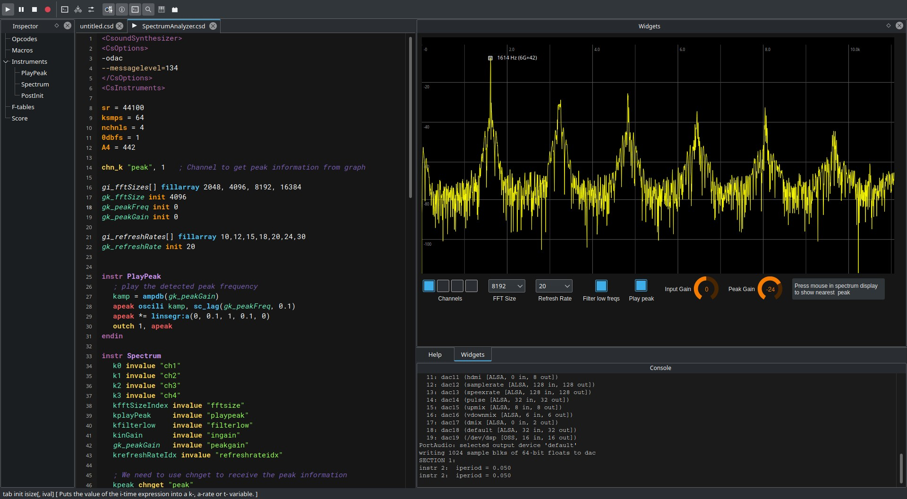
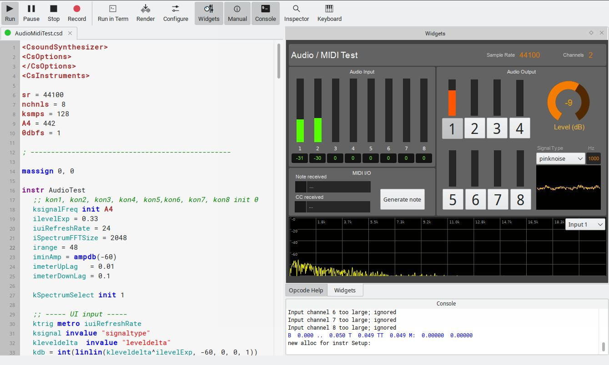
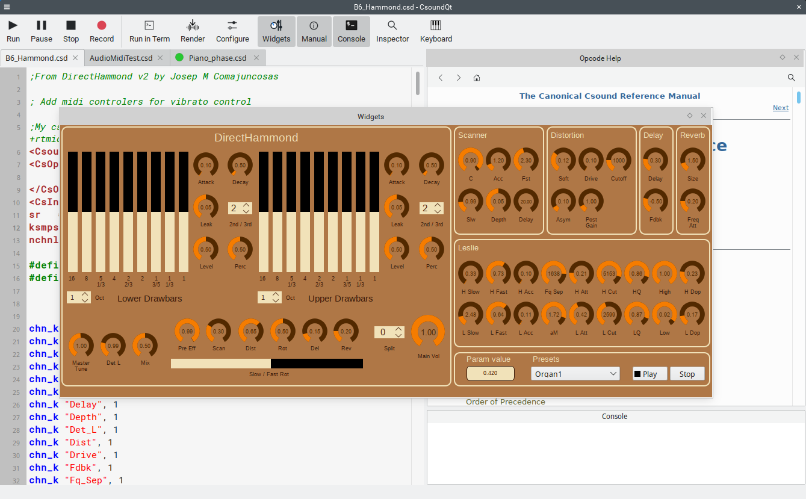
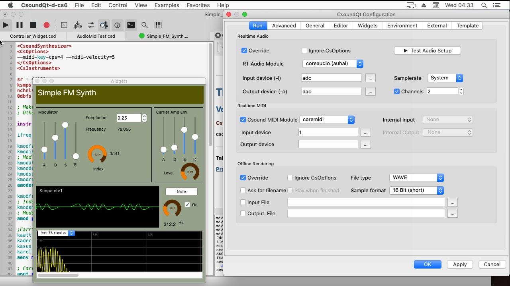
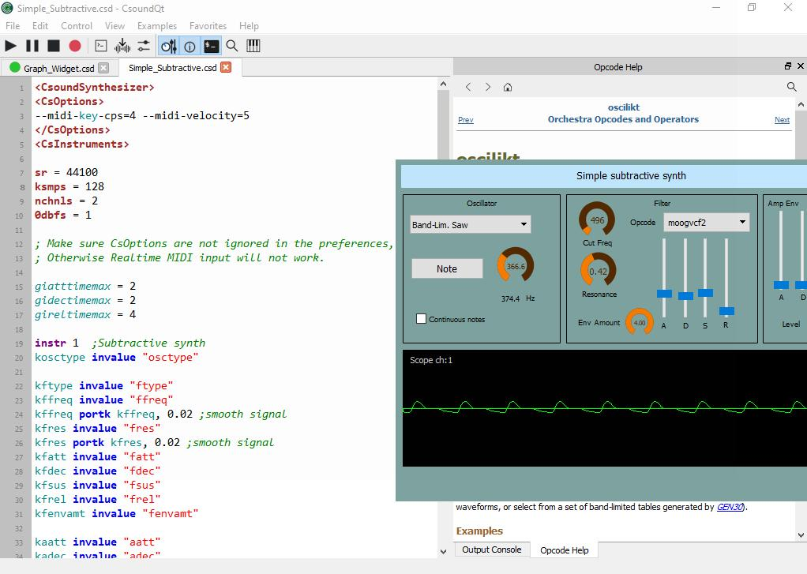

---

[CsoundQt](http://csoundqt.github.io) is a frontend for [Csound](http://csound.github.io/) featuring a
syntax-highlighting editor with autocomplete, interactive widgets, and integrated help. It is cross-platform and
aims to be a simple yet powerful development environment for Csound.

**Csound** is a musical programming language with roots in the early days of computer
music. It is actively maintained and is one of the most powerful tools for sound processing and synthesis.

For more information visit the [CsoundQt Website](http://csoundqt.github.io).

## Download

Download the latest binary for your platform from the [Releases page](https://github.com/CsoundQt/CsoundQt/releases).

**CsoundQt** requires [Csound](https://github.com/csound/csound/releases) to be installed.
The current version is compatible with csound `7.0` and later.

---

## Screenshots

### Linux

### macOS

### Windows

