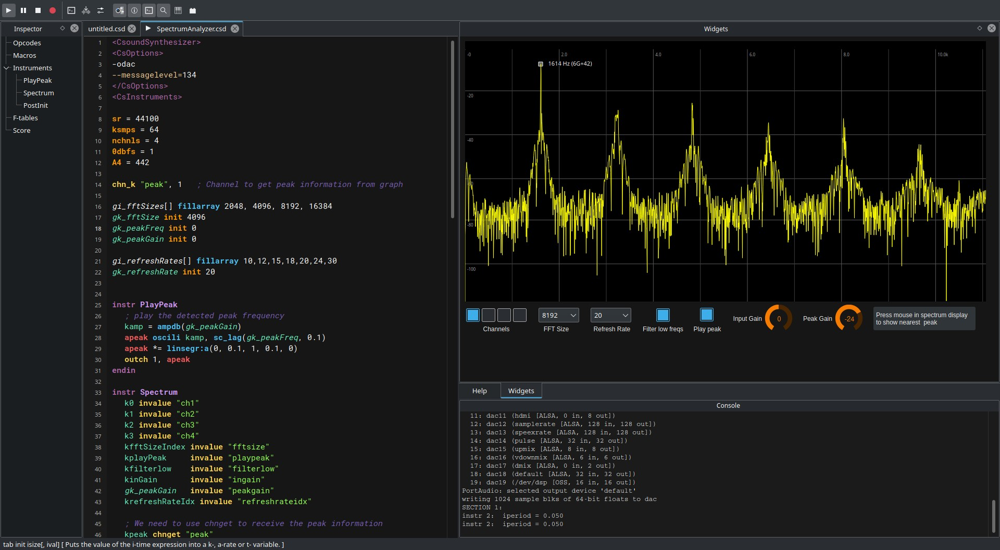
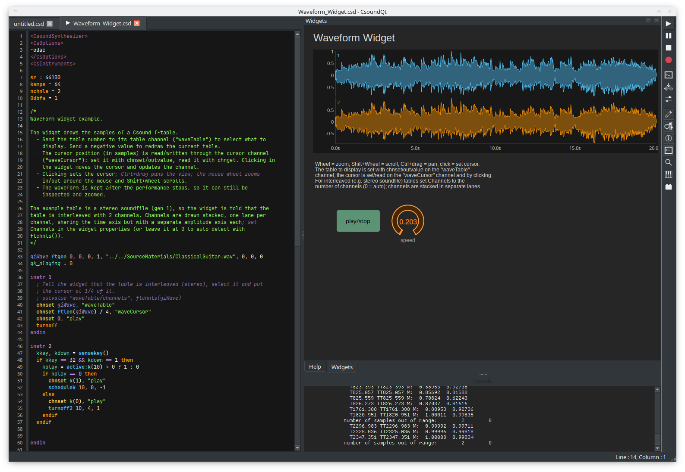
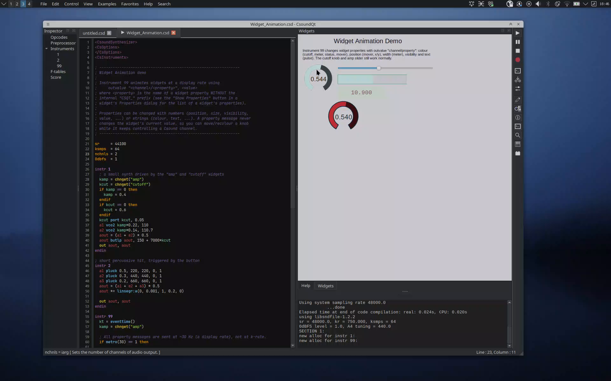
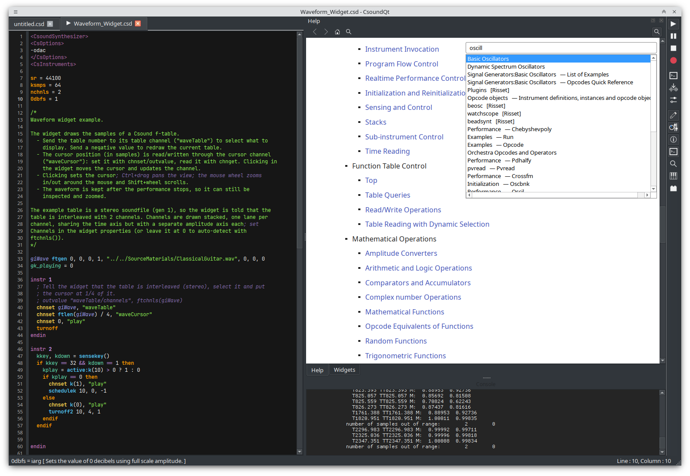
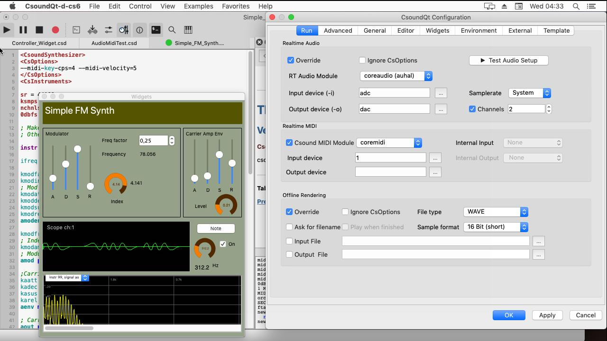
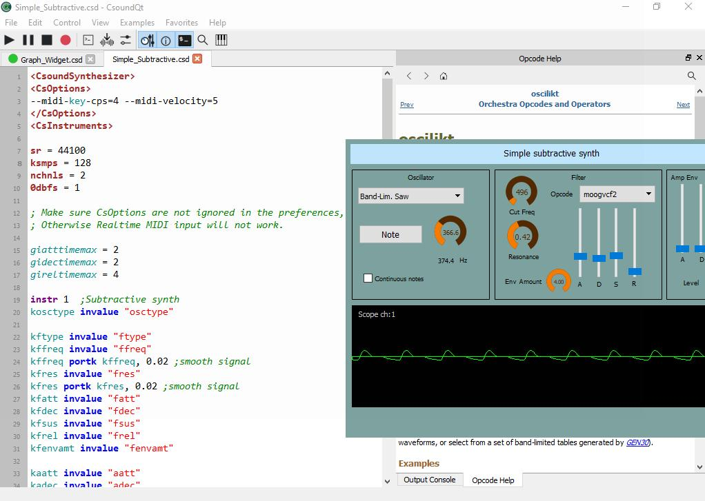

  

<h3 align="center">A cross-platform frontend for Csound</h3>

  
  
  
  

**CsoundQt** is a cross-platform frontend for [Csound](https://csound.com):
a syntax-highlighting editor with autocomplete, a visual widget panel for
building interactive instruments and effects, and an integrated offline manual.
It aims to be a simple yet powerful development environment for both newcomers
and experienced Csound users.

> [!IMPORTANT]
> CsoundQt 7 requires **Qt 6** and **Csound 7**. Csound 6 and Qt 5 are no longer supported.

---

## What's new in 7.2

- **Waveform widget** – draws the samples of a Csound f-table directly, one
  lane per channel. Wheel zooms, Shift+wheel scrolls, Ctrl+drag pans, and the
  view follows the cursor. The waveform stays visible after the performance stops.
- **Flat, themeable buttons** – a fully configurable style (background, pressed
  background, text, pressed text, border colour/width/radius) rendered by
  CsoundQt itself, so it looks identical on every platform.
- **Widget animation from Csound** – any widget property can be changed from the
  orchestra with `outvalue "<channel>/<property>", value`.
- **Scope can monitor any audio channel** – `chnset asignal, "scopechan"` is
  displayed by a scope whose second channel is set to `scopechan`.
- **Inline find bar** and a new lightweight **integrated manual viewer** with
  **whole-manual search** (no QtWebEngine dependency in default builds).
- **Much faster startup** and widget/channel handling, plus **AppImage** and
  **Flathub** packages that bundle Qt, Csound, the manual and plugins.

## Features

### Editor
- Syntax highlighting for Csound 7; autocomplete for opcodes, instrument names,
  macros and `@global` variables
- Split orchestra/score view, score column-header detection, font zoom
- Inline find bar with incremental search, wrap-around and all-match highlighting
- Auto-reload when the file changes on disk; open files by drag & drop;
  hide/show the editor (Ctrl/Cmd+0) when working with an external editor

### Widgets
- Visual panel: sliders, knobs, buttons (native or flat), controllers, meters,
  graphs, scopes, waveform, displays, line edits, dropdowns, …
- Change widget properties at runtime from Csound (`outvalue`) for animation and
  dynamic interfaces
- Widgets communicate through Csound channels; `chn_` declarations are no longer
  needed for control channels
- Scopes can display either the audio output or any named Csound audio channel

### Help & more
- Integrated offline manual (litehtml), whole-manual search, find box, history,
  zoom and text selection; links to the Csound and FLOSS manuals
- Light/dark themes that can follow the system and switch at runtime
- Live code evaluation against a running instance and a Scratch Pad
- GEN7 / freehand / GEN10 table editors, virtual MIDI keyboard, MIDI learn
- Optional interactive HTML5 GUI support (`CONFIG+=html_support` builds)
- Reorganized, updated example collection (opened read-only)

## Screenshots

### Platforms

## Download

Get the latest binary from the [Releases page](https://github.com/CsoundQt/CsoundQt/releases/latest).

- **Linux** – self-contained [AppImage](https://github.com/CsoundQt/CsoundQt/releases/latest)
  (Qt, Csound, manual and plugins bundled) or
  [Flatpak on Flathub](https://flathub.org/apps/io.github.CsoundQt.CsoundQt);
  CsoundQt is also available in most distribution repositories.
- **macOS** – universal `.dmg` (Intel + Apple Silicon).
- **Windows** – Inno Setup installer (install Csound 7 first).
- **Source** – see [`BUILDING.md`](BUILDING.md).

CsoundQt needs a **Csound 7** installation; the AppImage and Flatpak bundles ship
their own.

## Documentation & community

- Website & manual: <https://csoundqt.github.io> · <https://csoundqt.github.io/doc/>
- [Wiki](https://github.com/CsoundQt/CsoundQt/wiki) ·
  [Issue tracker](https://github.com/CsoundQt/CsoundQt/issues) ·
  [CsoundQt users mailing list](https://lists.sourceforge.net/lists/listinfo/qutecsound-users)
- Release notes: [`release_notes/`](release_notes/)

## Contributing

Development happens on the `csoundqt7` branch; fork the repository and open a
pull request. See [`BUILDING.md`](BUILDING.md) and the
[wiki](https://github.com/CsoundQt/CsoundQt/wiki).

## License

CsoundQt is licensed under the **GPLv3**, or at your option the **LGPLv2.1**.
It was originally written by Andrés Cabrera and is maintained by the CsoundQt
community.
