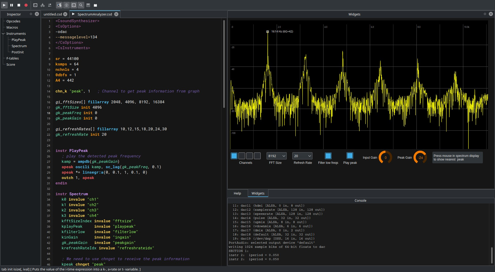

---

[CsoundQt](http://csoundqt.github.io) is a frontend for [Csound](http://csound.github.io/) featuring a highlighting editor with autocomplete, interactive widgets and integrated help. It is cross-platform and aims to be a simple yet powerful and complete development environment for Csound. 

Csound is a musical programming language with a very long history, with roots in the origins of computer music. It is still being maintained by an active community and despite its age, is still one of the most powerful tools for sound processing and synthesis. 

For more information visit the [CsoundQt Website](http://csoundqt.github.io).

## Download

Go to [Releases](https://github.com/CsoundQt/CsoundQt/releases) to download the latest binary for your platform.

**CsoundQt** needs **csound** to be installed. Current version is compatible with Csound `6.1` and later. To install csound go here: <https://github.com/csound/csound/releases>

## Screenshots

### Linux

### macOS

### Windows

